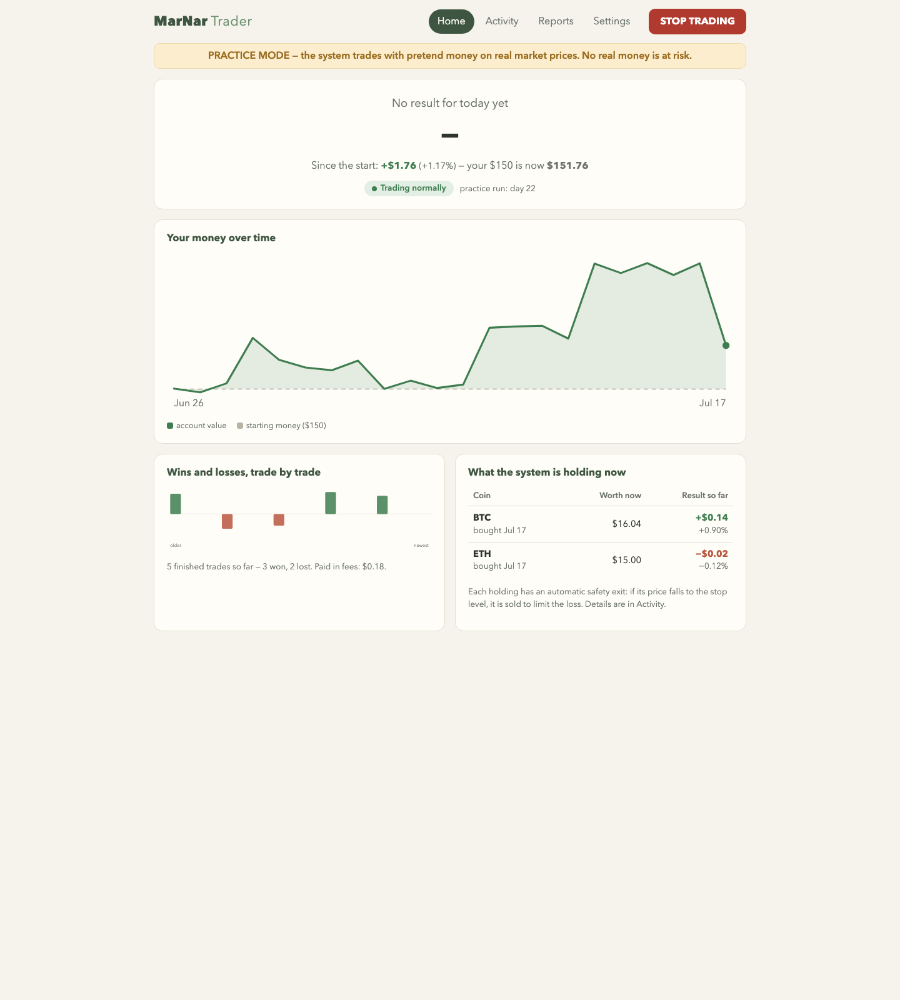
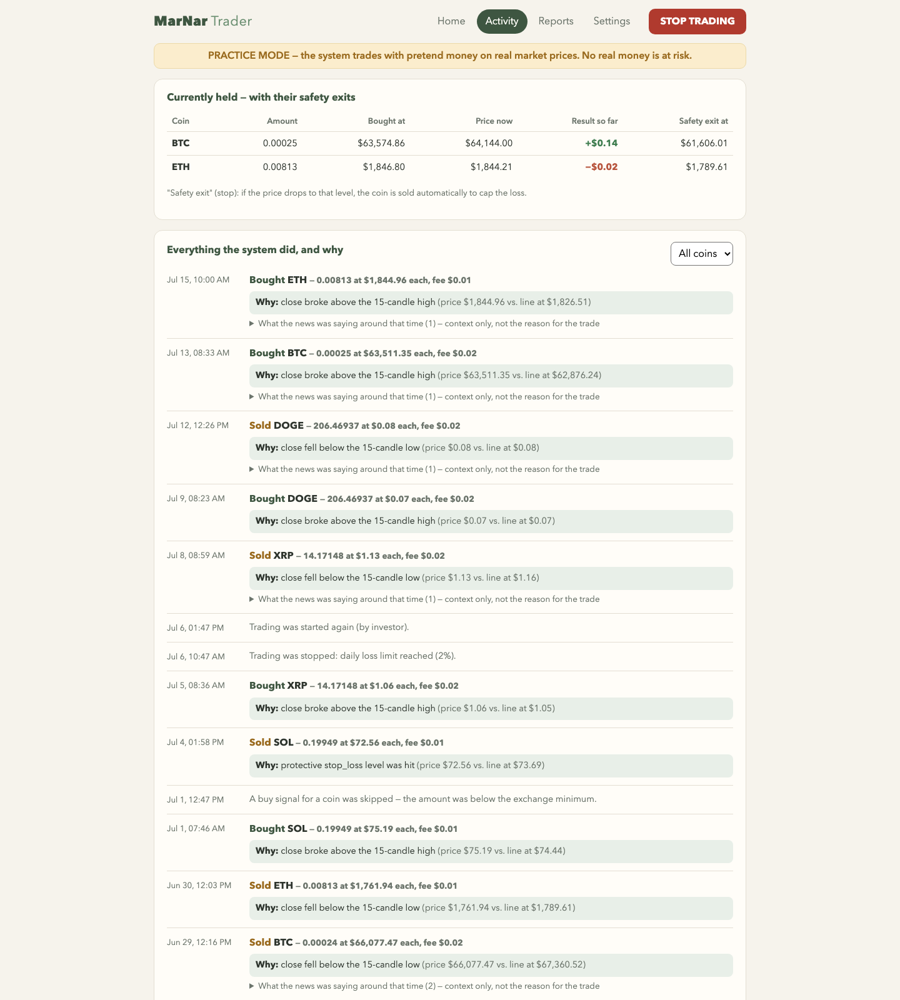
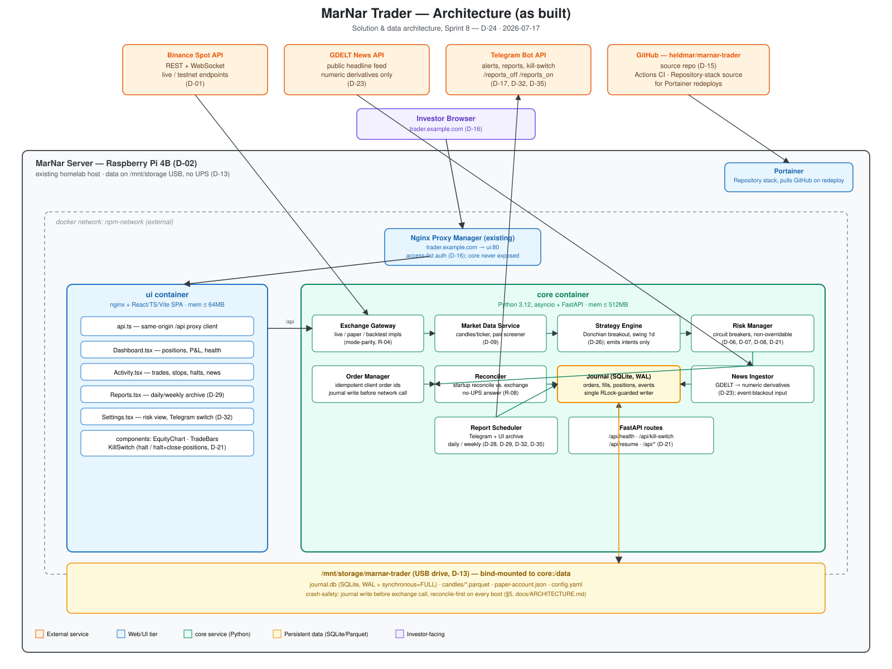
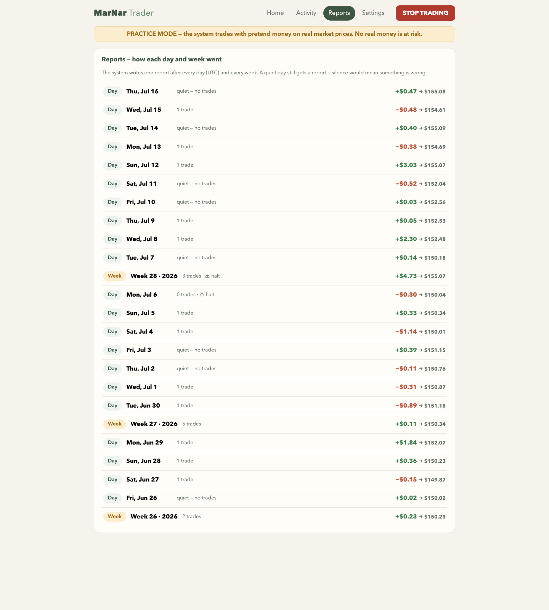
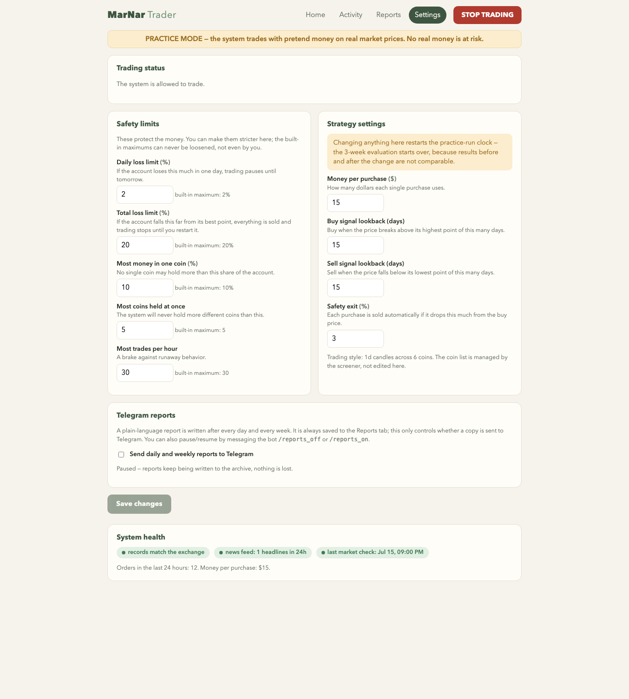

# MarNar Trader

> ### ⚠️ Project status: discontinued — no demonstrated edge
>
> **This system was never run with real money, and the strategy it ships did not
> work.** In an 18-day live paper run (2026-07-30 → 2026-08-17) it returned
> **−2.07%** with **0 winners in 4 closed trades**, and it lost to both of its
> pre-registered benchmarks over the same window. Walk-forward backtesting told
> the same story: 61 of 80 parameter settings lost money out-of-sample.
>
> The engineering below — crash-safe journaling, enforced risk floors,
> reconciliation, paper mode, the backtesting toolkit — is real, tested, and
> genuinely reusable. **The trading edge is not.** Treat the shipped Donchian
> strategy as a placeholder to replace, not as something to fund.
>
> Full evidence: [docs/LIVE-RUN-REVIEW-2026-08-17.md](docs/LIVE-RUN-REVIEW-2026-08-17.md).
> Development stopped 2026-08-17; this repository is published as-is for anyone
> who wants the machinery. **Trading carries real risk of loss. Nothing here is
> financial advice.**

**An autonomous crypto trading system you actually own.** MarNar Trader runs
24/7 on your own hardware, trades Binance Spot with a transparent, rules-based
strategy, and reports back in plain language — what it did, why it did it, and
what it cost. No cloud subscription, no black box, no custody of your keys by
anyone but you.



## Why it's different

Most trading bots optimize for excitement. MarNar Trader optimizes for
**trust**:

- **Safety first, by construction.** Hard circuit breakers — daily-loss stop,
  drawdown halt, per-coin position caps, trade-rate limits — enforced below
  the strategy, with non-negotiable floors that configuration can only
  tighten, never loosen. A red STOP TRADING button is on every screen.
- **Crash-safe by design.** Every decision is journaled to a write-ahead
  SQLite system of record *before* it touches the exchange. Deterministic
  order IDs mean a crash-and-retry can never double-place an order; on every
  boot the system reconciles against the exchange before trading unlocks.
- **Truthful reporting.** Every trade carries the exact rule and numbers that
  fired it. News headlines are shown *around* trades as context — never
  claimed as the cause. A daily report arrives on Telegram after every UTC
  day (and a weekly on Mondays), with the full archive browsable in the UI.
  Quiet days still report, so silence always means something is wrong — never
  "nothing happened".
- **Evidence before money.** The strategy shipped here (Donchian channel
  breakout, daily candles) was tuned by walk-forward backtesting over two
  years of data and then had to survive a multi-week paper-trading gate — the
  full production system trading simulated money on live prices — before real
  funds could ever be enabled. **It did not survive that gate** (see the status
  note above); the process worked, the strategy did not.
- **Built for non-traders.** The web UI explains itself in plain language:
  "You made money today", "why: the price broke above its 15-day high",
  "safety exit at $x". Depth is one tap away, jargon is not required.



## What's inside

| Piece | What it does |
|-------|--------------|
| Core service (Python 3.12, FastAPI) | Strategy engine, risk manager, order manager, reconciler, crash-safe journal |
| Web UI (React + TypeScript) | Dashboard, activity timeline, report archive, settings, kill switch |
| Telegram alerts & reports | Trade/halt alerts in real time; daily & weekly plain-language reports |
| Backtesting & research toolkit | Historical downloader, fee/slippage-modeled backtester, pair screener, walk-forward tuner |
| Paper mode | The whole stack against live market prices with a simulated account — the mandatory proving ground |

It runs anywhere Docker runs — a Raspberry Pi is enough (the reference
deployment uses one). Two containers, ~600 MB of RAM, no external database.







## Get started

**[docs/INSTALL.md](docs/INSTALL.md)** takes you from `git clone` to your own
running instance — including creating your own Telegram bot — in about
fifteen minutes. Start in paper mode (the default): it trades pretend money
on real prices, so you can watch it work with zero risk.

Further reading:

- [docs/ARCHITECTURE.md](docs/ARCHITECTURE.md) — how it's built and why.
- [docs/RUNBOOK-PAPER.md](docs/RUNBOOK-PAPER.md) — operating the paper run.

## Development

```sh
cd core
pip install -e ".[dev]"
pytest -m "not integration"        # unit tests
ruff check .                       # lint

cd ../ui
npm install && npm run lint && npm run build
```

Full local stack (paper mode, UI on `localhost:18081`):

```sh
docker compose -f docker-compose.yml -f docker-compose.local.yml up --build
```

## Security posture

- API keys and tokens live only in environment variables — never in files
  tracked by Git, never in the config file.
- Exchange keys are trade-only: **withdrawal permission stays disabled**.
- The core service is never exposed publicly; only the UI container is
  routed, and the reference deployment keeps it behind reverse-proxy
  authentication.
- State-changing endpoints require a CSRF header; risk limits can only be
  tightened at runtime, never loosened.

*Screenshots above are from paper mode — simulated money on live market
prices; no real funds are shown.*
